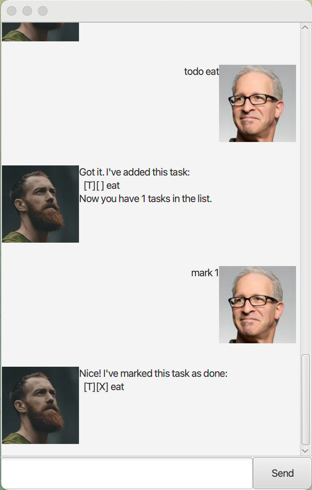

# Luke User Guide

> **Product name:** Luke (aka **SimBot**)
>
> **Version:** 1.0 (Java 17)


---

## Introduction

Luke is a lightweight task manager with a friendly chat-style interface. You type a command, Luke replies with the result, and your tasks are stored locally so they persist between runs. This guide shows you how to use Luke from the GUI or CLI.

---

## Getting Started

**Requirements**

* Java **17**
* (Recommended) IntelliJ IDEA

**Run**

* GUI: run `launcher.Launcher` or `luke.Launcher` (depending on your project’s entry point).
* CLI (if present): run the main class (e.g., `luke.Main`/`Duke`).

**Data storage**

* Tasks are auto‑saved after any change (add/mark/unmark/delete).
* The default save location is configured in `Storage.java` (typically in the `data/` folder). Change it there if you want a custom path.

**Indices**

* Commands that take an index (e.g., `mark`, `unmark`, `delete`) use **1‑based indices**, i.e., the numbers shown by `list`.

---

## Command Summary

### General

* `help` — Show help
* `bye` — Exit the app
* `echo <text>` — Echo back what you type

### Viewing & Searching

* `list` — Show all tasks with 1‑based numbering
* `find <keyword>` — Show tasks whose description contains `<keyword>`

### Adding Tasks

* `todo <desc>` — Add a to‑do
* `deadline <desc> /by <yyyy-mm-dd | free text>` — Add a deadline
* `event <desc> /from <start> /to <end>` — Add an event

### Updating Tasks

* `mark <index>` — Mark task as done
* `unmark <index>` — Mark task as **not** done
* `delete <index>` — Delete task

---

## Using Luke — Examples & Expected Output

> **Note:** Output format may vary slightly by theme/implementation, but structure will match what’s shown here.

### 1) `help`

**Example**

```
help
```

**Expected output**

```
SimBot Help
-------------------------
General:
  help                    Show this help
  bye                     Exit the app

Viewing & Searching:
  list                    Show all tasks
  find <keyword>          Find tasks containing keyword

Adding:
  todo <desc>
  deadline <desc> /by <yyyy-mm-dd|free text>
  event <desc> /from <start> /to <end>

Updating:
  mark <index>
  unmark <index>
  delete <index>
```

### 2) `list`

Shows all tasks with 1‑based numbering. If empty, Luke tells you.

**Example**

```
list
```

**Expected output**

```
Your list is empty.
```

*(After adding tasks, you’ll see:)*

```
Here are the tasks in your list:
1. [T][ ] read book
2. [T][ ] eat lunch
```

### 3) `todo`

Add a to‑do item.

**Example**

```
todo read book
```

**Expected output**

```
Got it. I've added this task:
  [T][ ] read book
Now you have 1 tasks in the list.
```

### 4) `deadline`

Add a deadline. Dates accept ISO format (`yyyy-mm-dd`). If the date cannot be parsed, Luke stores the raw text for display.

**Example (ISO date)**

```
deadline CS2103T iP /by 2025-09-30
```

**Expected output**

```
Got it. I've added this task:
  [D][ ] CS2103T iP (by: 2025-09-30)
Now you have 2 tasks in the list.
```

**Example (free text time)**

```
deadline submit taxes /by end of month
```

**Expected output**

```
Got it. I've added this task:
  [D][ ] submit taxes (by: end of month)
Now you have 3 tasks in the list.
```

### 5) `event`

Add an event with start and end fields.

**Example**

```
event Hackathon /from 2025-10-10 09:00 /to 2025-10-11 18:00
```

**Expected output**

```
Got it. I've added this task:
  [E][ ] Hackathon (from: 2025-10-10 09:00 to: 2025-10-11 18:00)
Now you have 4 tasks in the list.
```

### 6) `mark`

Mark a task done using the 1‑based index shown in `list`.

**Example**

```
mark 2
```

**Expected output**

```
Nice! I've marked this task as done:
  [T][X] eat lunch
```

### 7) `unmark`

Mark a task *not* done.

**Example**

```
unmark 2
```

**Expected output**

```
OK, I've marked this task as not done yet:
  [T][ ] eat lunch
```

### 8) `delete`

Delete a task by index.

**Example**

```
delete 3
```

**Expected output**

```
Noted. I've removed this task:
  [D][ ] submit taxes (by: end of month)
Now you have 3 tasks in the list.
```

### 9) `find`

Show tasks whose description contains the keyword (case‑insensitive).

**Example**

```
find read
```

**Expected output**

```
Here are the matching tasks in your list:
1. [T][ ] read book
```

### 10) `echo`

Echo back your text.

**Example**

```
echo hello world
```

**Expected output**

```
hello world
```

---

## Error Messages & Recovery

Luke aims to give friendly, actionable errors.

* **Empty command**

    * Input: *(blank)* → `OOPS!!! Empty command.`
* **Unknown command**

    * Input: `smth` → `OOPS!! I'm sorry, but I don't know what that means :(`
* **Missing parts**

    * Input: `deadline report` → `OOPS!!! Deadline requires description and /by time.`
    * Input: `event conf /from Fri` → `OOPS!!! Event requires description, /from and /to.`
* **Index errors**

    * Input: `mark 0` or out of range → `OOPS!!! Index out of range. Use 1..N.`
    * Input: `mark two` → `OOPS!!! Index must be a number.`
* **Empty list**

    * Input: `delete 1` when no tasks → `Your list is empty.`

---

## Tips & Notes

* Use `list` frequently to confirm indices before `mark`, `unmark`, or `delete`.
* ISO dates (`yyyy-mm-dd`) enable nicer display for `deadline`. Free‑text is accepted for flexibility.
* All changes persist automatically after each modifying command.

---

## Troubleshooting

* **Commands do nothing / red squiggles in IDE** → Ensure Project SDK is **Java 17**; invalidate caches & restart if needed.
* **Wrong task marked/unmarked** → Re‑run `list` and use the **1‑based** index shown there.
* **Storage file not created** → Check that the `data/` folder is writable; verify the path in `Storage.java`.

---

## Credits

Based on the CS2103/T Duke template. Built with Java 17 and JavaFX (for GUI).
